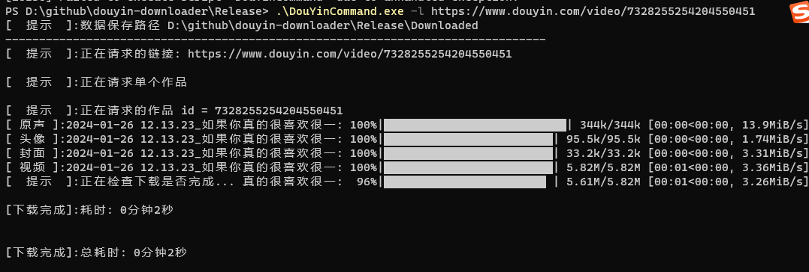
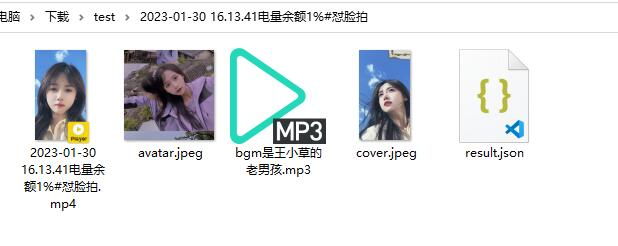

# 抖音批量下载工具功能介绍

💁 支持个人主页链接、作品分享链接、抖音直播Web链接、合集链接、音乐(原声)集合链接

🔽 支持单个作品下载、主页作品下载、主页喜欢下载、直播解析、单个合集下载、主页所有合集下载、音乐(原声)集合下载

📹 下载视频、视频封面、音乐、头像

💦 去水印下载

⏭️ 自动跳过已下载

👉 支持指定下载作品数量

🔗 多线程下载、多链接下载

📈 增量更新与数据持久化到数据库, 保存每条作品信息到数据库, 并根据数据库是否存在来增量请求下载


# 申明

本项目只作为学习用途, 切勿他用.

# 使用截图





# 使用方法

- 支持的地址格式, 形如

```
抖音链接:
1. 作品(视频或图集)、直播、合集、音乐集合、个人主页    https://v.douyin.com/BugmVVD/    
抖音网页版浏览器URL:
2. 单个视频             https://www.douyin.com/video/6915675899241450760
3. 单个图集             https://www.douyin.com/note/7014363562642623777
4. 用户主页             https://www.douyin.com/user/MS4wLjABAAAA06y3Ctu8QmuefqvUSU7vr0c_ZQnCqB0eaglgkelLTek
5. 单个合集             https://www.douyin.com/collection/7208829743762769975
6. 音乐(原声)下的视频     https://www.douyin.com/music/7149936801028131598
7. 直播                https://live.douyin.com/759547612580                     
```

# 抖音批量下载工具

批量下载有两种方式运行, 配置文件和命令行

默认使用配置文件方式，在配置文件`config.example.yml`中修改内容后，将文件另存为`config.yml`。

### 安装依赖

windows用户下载 Release文件夹 中的 [DouYinCommand.exe]文件运行


### 配置文件方式

配置文件名必须叫 `config.yml`, 并将其放在DouYinCommand.py或者DouYinCommand.exe同一个目录下

直接运行DouYinCommand.py或者DouYinCommand.exe, 无需在命令中加入任何参数, 所有参数都从配置文件中读取

基本配置示例[config.yml](./config.yml), 请自己登录网页版抖音后F12获取cookie


### 命令行方式

运行示例:

- 获取帮助信息

```
windows用户:
.\DouYinCommand.exe -l https://www.douyin.com/video/7328255254204550451
```

- 参数介绍

```
-h, --help                       展示帮助信息
--link LINK, -l LINK             作品(视频或图集)、直播、合集、音乐集合、个人主页的分享链接或者电脑浏览器网址, 可以设置多个链接
                                 (删除文案, 保证只有URL, https://v.douyin.com/kcvMpuN/ 或者 https://www.douyin.com/开头的)
```
参考：https://github.com/jiji262/douyin-downloader
